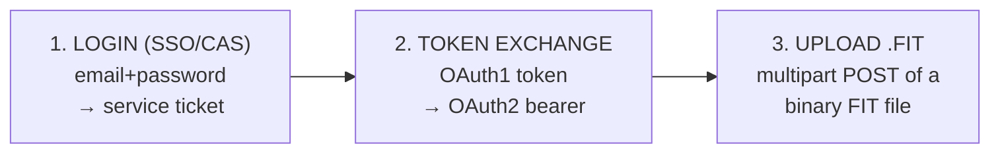
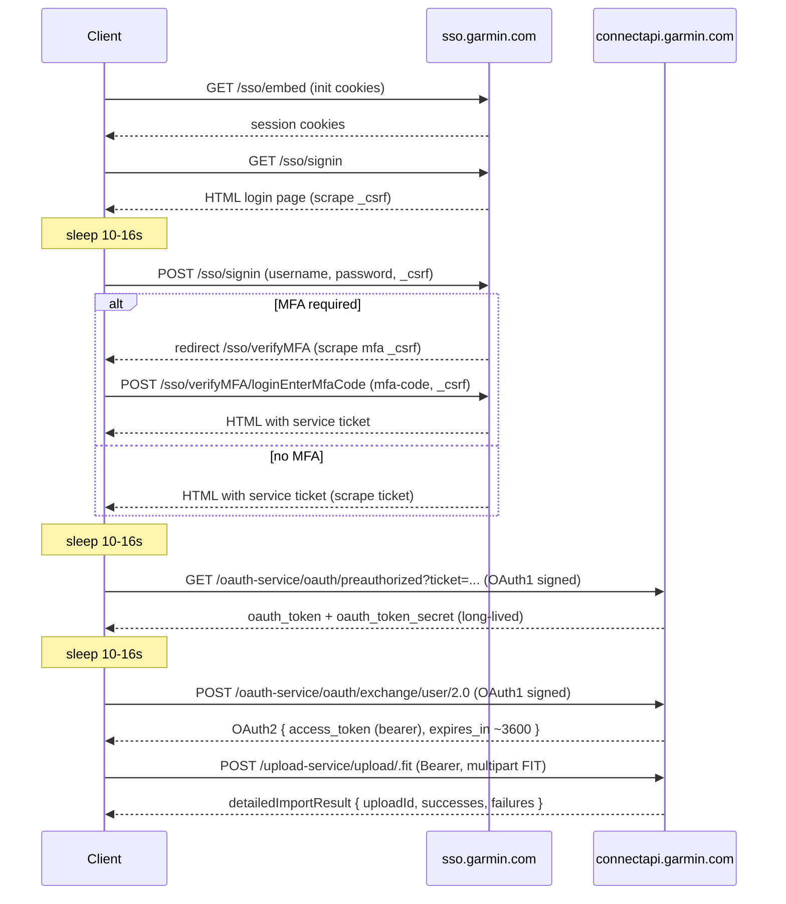
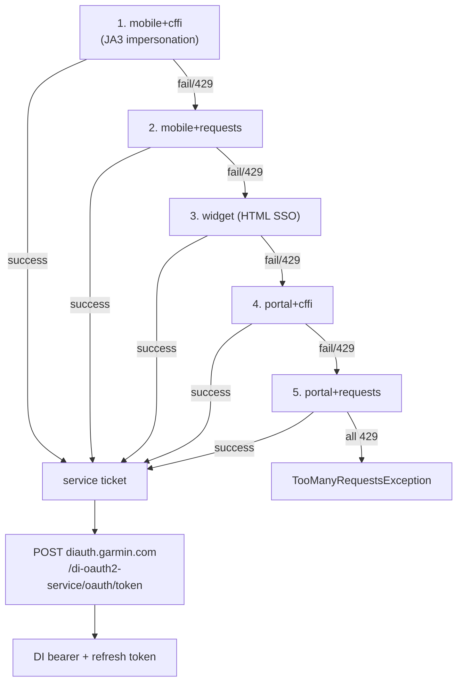
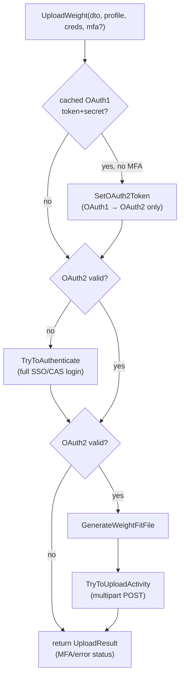

# Garmin Connect Write Mechanism — Architecture & Protocol Analysis

Reference implementation: `yet-another-garmin-connect-client` (YAGCC), a C#/.NET
library that creates `.fit` files and uploads health/activity data to Garmin
Connect. This document reverse-engineers **how it authenticates, which APIs it
talks to, and how data actually lands in Garmin Connect**, so the mechanism can
be re-implemented in Go.

---

## 1. High-Level Overview

Garmin Connect has **no official public write API**. To push data you must
impersonate the mobile app / web SSO flow. The whole thing is a three-act play:



Data is **never** sent as JSON body fields. Everything Garmin ingests — weight,
body composition, blood pressure, activities — is packaged into a binary **FIT
file** and uploaded to the `upload-service`. Garmin's backend parses the FIT
file and files the measurements into the right place.

The reference repo contains **two independent auth implementations**:

| Implementation | Class | Status | What it produces |
|---|---|---|---|
| **Legacy CAS + OAuth1/OAuth2** | `Client` (`Client.Auth.cs`) | Active — used by `UploadWeight`/`UploadBlood` | OAuth2 bearer token |
| **Multi-strategy mobile/portal** | `GarminConnectClient` (`MultiFlowAuth/`) | Newer / experimental | DI (Digital Identity) bearer token |

Section 3 covers the legacy flow (the one wired into uploads). Section 4 covers
the newer multi-strategy flow.

---

## 2. Consumer Keys (the "app identity")

OAuth1 needs a consumer key + secret that identify the Garmin mobile app. YAGCC
does **not** ship them hardcoded in the important path — it fetches them at
runtime:

```
URLs.GARMIN_API_CONSUMER_KEYS =
  https://github.com/lswiderski/yet-another-garmin-connect-client/raw/main/oauth_consumer.json
```

`oauth_consumer.json`:
```json
{
  "consumer_key": "fc3e99d2-118c-44b8-8ae3-03370dde24c0",
  "consumer_secret": "E08WAR897WEy2knn7aFBrvegVAf0AFdWBBF"
}
```

These are the **well-known Garmin Connect Mobile consumer credentials** (the same
pair used by `python-garminconnect`, Garth, etc.). They rarely change. Fetching
from a remote URL lets the author rotate them without a library release.

`ClientFactory.Create(server)` downloads this JSON, then builds a `Client` bound
to a domain (`garmin.com` global, or `garmin.cn` for China).

---

## 3. Legacy Authentication Flow (the active path)

This is the CAS (Central Authentication Service) + OAuth flow implemented in
`Client.Auth.cs`. It is what `UploadWeight` actually calls.

### 3.1 Endpoints

| Purpose | URL |
|---|---|
| SSO embed (cookie init) | `https://sso.garmin.com/sso/embed` |
| SSO signin (CSRF + credentials) | `https://sso.garmin.com/sso/signin` |
| MFA code entry | `https://sso.garmin.com/sso/verifyMFA/loginEnterMfaCode` |
| OAuth1 preauthorized | `https://connectapi.garmin.com/oauth-service/oauth/preauthorized` |
| OAuth2 exchange | `https://connectapi.garmin.com/oauth-service/oauth/exchange/user/2.0` |
| Upload | `https://connectapi.garmin.com/upload-service/upload/<format>` |

`User-Agent` for the SSO/legacy calls is the Android app id string:
`com.garmin.android.apps.connectmobile`.

### 3.2 Step-by-step

**Step 0 — Init cookie jar** (`InitCookieJarAsync`)
- `GET /sso/embed` with common query params (`id=gauth-widget`, `embedWidget=true`,
  `gauthHost/service/source/... = https://sso.garmin.com/sso/embed`).
- Captures Garmin's session cookies into a cookie jar reused for every later call.

**Step 1 — Get CSRF token** (`GetCsrfTokenAsync` → `FindCsrfToken`)
- `GET /sso/signin` with the widget query params + the cookie jar.
- The response is an HTML login page. The CSRF token is scraped with regex:
  `name="_csrf"\s+value="(?<csrf>.+?)"`.

**Step 2 — Send credentials** (`SendCredentialsAsync`)
- `POST /sso/signin` (url-encoded) with body:
  `username`, `password`, `embed=true`, `_csrf=<token>`.
- Extra headers: `origin`, `referer=https://sso.garmin.com/sso/signin`, `NK: NT`.
- Redirects are tracked (`OnRedirect`). Two outcomes:
  - **MFA required** — redirect URL contains `/sso/verifyMFA/loginEnterMfaCode`.
    A second CSRF token is scraped from the MFA page and stored; the method
    returns early with `MFACodeRequested = true`.
  - **Success** — the response HTML contains a **service ticket** embedded in a
    URL, scraped with regex `embed\?ticket=(?<ticket>[^"]+)"`.

**Step 2b — MFA completion** (`CompleteMFAAuthAsync` → `SendMfaCodeAsync`)
- `POST /sso/verifyMFA/loginEnterMfaCode` (url-encoded) with:
  `embed=true`, `mfa-code=<code>`, `fromPage=setupEnterMfaCode`, `_csrf=<mfaCsrf>`.
- Response HTML again carries the service ticket → falls through to Step 3.

**Step 3 — OAuth1 (service ticket → request token)** (`GetOAuth1Async`)
- The service ticket is exchanged for an OAuth1 token pair.
- `GET https://connectapi.garmin.com/oauth-service/oauth/preauthorized?ticket=<ticket>&login-url=https://sso.garmin.com/sso/embed&accepts-mfa-tokens=true`
- Signed with the **consumer key/secret** using OAuth1 (`OAuthRequest.ForRequestToken`),
  passed as an `Authorization:` OAuth header.
- Response body is url-encoded: `oauth_token=...&oauth_token_secret=...`.
  These are the long-lived OAuth1 credentials that can be **persisted and reused**
  to skip login entirely next time.

**Step 4 — OAuth2 (OAuth1 → bearer token)** (`GetOAuth2Token`)
- `POST https://connectapi.garmin.com/oauth-service/oauth/exchange/user/2.0`
- Signed with OAuth1 as a **protected resource** request
  (`OAuthRequest.ForProtectedResource("POST", consumerKey, consumerSecret,
  oAuthToken, oAuthTokenSecret)`), empty url-encoded body.
- Response is JSON deserialized into `OAuth2Token`:
  ```json
  {
    "scope": "...",
    "jti": "...",
    "access_token": "eyJ...",
    "token_type": "Bearer",
    "refresh_token": "...",
    "expires_in": 3599,
    "refresh_token_expires_in": 7199
  }
  ```
- `access_token` is the **bearer token** used for all data uploads.
  Validity is tracked locally: `_oAuth2TokenValidUntil = UtcNow + expires_in`.
  `IsOAuthValid` gates whether re-auth is needed.

### 3.2b Sequence (login → upload)



### 3.3 Anti-bot / rate-limit evasion

Garmin sits behind Cloudflare. YAGCC deliberately slows the flow:
- **Random sleeps of 10–16 seconds** (`Thread.Sleep`) between each auth step.
- Detects Cloudflare block: HTTP 403 with body `error code: 1020` →
  `AuthStatus.AuthBlockedByCloudFlare`; HTTP 429 → treated as rate-limited.
- Uses the mobile-app `User-Agent`.

Practical implication for a Go port: a full cold login takes ~40–60s. **Cache the
OAuth1 token pair** and reuse it (Section 3.4) to avoid the SSO dance on every run.

### 3.4 Token reuse (skip login)

`UploadWeight` accepts a `CredentialsData` with optional `AccessToken` +
`TokenSecret` (these are the **OAuth1** token/secret, not the OAuth2 bearer). If
present:
```
SetOAuth2Token(AccessToken, TokenSecret)   // does only Step 4
```
It jumps straight to the OAuth2 exchange, skipping Steps 0–3 entirely. After any
successful auth, YAGCC returns the OAuth1 `AccessToken`/`TokenSecret` in
`UploadResult` so the caller can persist them for next time. The OAuth1 pair is
long-lived; the OAuth2 bearer is short-lived (~1h) and re-derived on demand.

---

## 4. Multi-Strategy Authentication Flow (newer, `MultiFlowAuth/`)

`GarminConnectClient` implements a **cascading 5-strategy** login that mirrors the
modern `garth`/`garminconnect` Python approaches and targets Garmin's newer
**Digital Identity (DI) OAuth2** endpoints. It is more resilient to Cloudflare/WAF
blocking. It is not the path the upload code uses, but it is the more future-proof
reference.

### 4.1 The 5 strategies (tried in order, first success wins)

| # | Name | Mechanism |
|---|---|---|
| 1 | `mobile+cffi` | iOS mobile login API + **TLS/JA3 fingerprint impersonation** (`MobileLoginWithTlsFingerprinting`) |
| 2 | `mobile+requests` | iOS mobile login API, plain HTTP (`DoMobileLoginAsync`) |
| 3 | `widget` | Classic SSO embed HTML form flow (same shape as Section 3) |
| 4 | `portal+cffi` | Web portal login + TLS fingerprint impersonation |
| 5 | `portal+requests` | Web portal login, plain HTTP (`DoPortalWebLoginAsync`) |

Each strategy ends by producing a **CAS service ticket**, then calls
`EstablishSessionAsync` → `ExchangeServiceTicketAsync` for tokens. On 429 it
records rate-limiting and falls through to the next strategy; if all 429, throws
`GarminConnectTooManyRequestsException`.



### 4.2 Mobile login (Strategies 1–2)

- `POST https://sso.garmin.com/mobile/api/login`
- Query: `clientId=GCM_IOS_DARK`, `locale=en-US`,
  `service=https://mobile.integration.garmin.com/gcm/ios`.
- JSON body: `{ username, password, rememberMe: true, captchaToken: "" }`.
- Headers use an **iOS Safari** User-Agent.
- Response JSON `responseStatus.type`:
  - `SUCCESSFUL` → `serviceTicketId`
  - `MFA_REQUIRED` → raise MFA (method from `customerMfaInfo.mfaLastMethodUsed`)
  - `INVALID_USERNAME_PASSWORD` → auth error

### 4.3 Portal login (Strategies 4–5)

- `GET  https://sso.garmin.com/portal/sso/en-US/sign-in` (loads the page)
- `POST https://sso.garmin.com/portal/api/login`
- Query: `clientId=GarminConnect`, `service=https://connect.garmin.com/app`.
- Same JSON body shape. Desktop Chrome User-Agent.
- 10–20s anti-WAF delay between GET and POST.

### 4.4 MFA (multi-flow)

- `POST /{mobile|portal}/api/mfa/verifyCode` with JSON:
  `{ mfaMethod, mfaVerificationCode, rememberMyBrowser: true, reconsentList: [], mfaSetup: false }`.
- Widget-flow MFA uses the legacy `/sso/verifyMFA/loginEnterMfaCode` HTML POST.
- Tries a primary + an alternate endpoint before giving up.

### 4.5 Service ticket → DI tokens (`ExchangeServiceTicketAsync`)

- `POST https://diauth.garmin.com/di-oauth2-service/oauth/token`
- Form body:
  ```
  client_id=<one of DI_CLIENT_IDS>
  service_ticket=<ticket>
  grant_type=https://connectapi.garmin.com/di-oauth2-service/oauth/grant/service_ticket
  service_url=<mobile/portal service url>
  ```
- `Authorization: Basic base64("<client_id>:")` (empty password).
- Headers `User-Agent: GCM-Android-5.23` and `X-Garmin-User-Agent: com.garmin.android.apps.connectmobile/5.23; ...`.
- Iterates over several client IDs (`GARMIN_CONNECT_MOBILE_ANDROID_DI_2025Q2`,
  `..._2024Q4`, `..._DI`, `..._IOS_DI`) until one works.
- Response JSON → `access_token` (the **DI bearer**, `DiToken`) + `refresh_token`.
- `TokenExpiresSoon` decodes the JWT `exp` claim and refreshes within a 15-min
  window.

### 4.6 TLS fingerprinting (`HttpCloakSession` / JA3)

Cloudflare fingerprints the TLS handshake (JA3). The strategies suffixed `+cffi`
route through `HttpCloakSession`, which carries a JA3 string / Akamai fingerprint
config so the handshake looks like a real Safari/Chrome/iOS client. Note: in this
repo the `HttpCloakClient` is a **thin wrapper over stock `HttpClient`** (it
stores JA3 in config but does not actually rewrite the handshake) — full JA3
impersonation would need a native library (curl-impersonate / BoringSSL). For a Go
port, the equivalent is a library like `utls` if Cloudflare blocks plain TLS.

---

## 5. Building the FIT File (the payload)

`FitFileCreator` (uses the Garmin **FIT SDK**, `Dynastream.Fit`) turns a
measurement into a binary FIT file. This is the actual data representation Garmin
ingests.

### 5.1 Weight / body composition (`CreateWeightBodyCompositionFitFile`)

FIT protocol V2.0. Messages written in order:

1. **FileIdMesg** — file identity:
   - `Type = File.Weight`
   - `Manufacturer = Garmin`
   - `GarminProduct = 2429`
   - `SerialNumber = 1234`
   - `TimeCreated = now (UTC)`
2. **UserProfileMesg** — `Gender`, `Age`, `Weight`, `Height` (SetHeight takes
   **meters** → `height_cm / 100`), `ActivityClass` (default 90), `MessageIndex=0`,
   `LocalId=0`.
3. **WeightScaleMesg** — the actual measurement:
   - `Timestamp` (UTC), `UserProfileIndex=0`, `Weight` (kg)
   - Optional: `PercentFat`, `PercentHydration`, `MuscleMass`, `BoneMass`,
     `MetabolicAge`, `PhysiqueRating`, `VisceralFatMass`, `VisceralFatRating`
   - `Bmi` — uses provided BMI, else computes `weight / (height_m)^2`, rounded to 1dp.
4. **DeviceInfoMesg** — cosmetic device metadata (battery voltage 384, cum
   operating time 45126). *Note: in the current code this message is built but
   `encoder.Write(deviceInfoMesg)` is not called before `Close()` — it is
   effectively a no-op.*

Output: `byte[]` of the encoded FIT file.

Input DTO (`GarminWeightScaleData`):
```
TimeStamp, Weight (float kg),
PercentFat?, PercentHydration?, BoneMass?, MuscleMass?,
VisceralFatRating?, VisceralFatMass?, PhysiqueRating?,
MetabolicAge?, BodyMassIndex?
```
`UserProfileSettings`: `Gender` (default Male), `Age?`, `Height?` (cm),
`ActivityClass` (default 90).

### 5.2 Blood pressure (`CreateBloodPressureFitFile`)

Same structure with `File.BloodPressure` + `BloodPressureMesg`
(systolic/diastolic/MAP/heart-rate/etc.).

---

## 6. Uploading the FIT File (`Client.UploadActivity`)

The single API call that writes data:

- `POST https://connectapi.garmin.com/upload-service/upload/.fit`
- **Auth:** `Authorization: Bearer <OAuth2 access_token>` (`WithOAuthBearerToken`).
- Headers: `NK: NT`, `origin: https://sso.garmin.com`, mobile `User-Agent`.
- Body: **multipart/form-data** with one file part named `"file"`,
  `Content-Type: application/octet-stream`, filename `<date>_YAGCC.fit`.
- Accepts HTTP `2xx` **and `409`** (409 = already uploaded / duplicate).

Response JSON (`UploadResponse.detailedImportResult`):
```json
{
  "detailedImportResult": {
    "uploadId": 123456789,
    "uploadUuid": { "uuid": "..." },
    "fileName": "...",
    "successes": [ ... ],
    "failures": [ { "messages": [ { "code": 202, "content": "..." } ] } ]
  }
}
```
Result interpretation:
- Any success → `UploadId` set, `IsSuccess = true`.
- Failure message `code == 202` → "Activity already uploaded" (benign dupe).
- Other failure codes → logged as errors.

---

## 7. End-to-End Orchestration (`UploadWeight`)

The public entry point ties it all together:

```
UploadWeight(weightDTO, userProfile, credentials, mfaCode?):
  1. If credentials has OAuth1 AccessToken+TokenSecret and no MFA:
        SetOAuth2Token(...)            // fast path: OAuth1 → OAuth2 only
  2. If OAuth2 not valid:
        TryToAuthenticate(email, pw, mfa)   // full SSO/CAS login (Section 3)
        → returns OAuth1 AccessToken/TokenSecret for caller to persist
  3. If OAuth2 valid:
        file = GenerateWeightFitFile(...)    // Section 5
        TryToUploadActivity(file)            // Section 6
  4. Return UploadResult { IsSuccess, UploadId, AccessToken, TokenSecret,
                           MFACodeRequested, AuthStatus, Logs, ErrorLogs }
```



`AuthStatus` is a detailed state enum (`PreInitCookies`, `CSRFReceivedSuccessful`,
`MFARedirected`, `Authenticated`, `AuthBlockedByCloudFlare`, …) used for
diagnostics and to drive the MFA round-trip.

---

## 8. Reference Map: What to Port to Go

| Concern | Reference file | Go equivalent notes |
|---|---|---|
| Consumer keys | `oauth_consumer.json`, `ClientFactory` | Hardcode or fetch the well-known pair |
| SSO/CAS login | `Client.Auth.cs` | Cookie jar + HTML CSRF/ticket regex scraping |
| OAuth1 signing | `OAuth` lib (`OAuthRequest`) | `dghubble/oauth1` or manual HMAC-SHA1 |
| OAuth2 exchange | `GetOAuth2Token` | Plain HTTP POST, parse JSON bearer |
| Token caching | `CredentialsData` in/out | Persist OAuth1 token+secret; re-derive OAuth2 |
| FIT encoding | `FitFileCreator` + FIT SDK | `tormoder/fit` (Go FIT lib) or the official SDK |
| Upload | `Client.UploadActivity` | multipart POST with bearer token |
| Cloudflare/JA3 | `MultiFlowAuth`, `HttpCloakSession` | `utls` if plain TLS gets blocked |
| MFA | `CompleteMFAAuthAsync` | Two-phase: return "MFA needed", re-invoke with code |
| Anti-rate-limit | random `Thread.Sleep` | Respect delays; cache tokens aggressively |

### Minimal viable Go path (weight sync)

1. Fetch/hardcode consumer key+secret.
2. If cached OAuth1 token+secret exists → OAuth2 exchange only.
3. Else run SSO login: cookie init → CSRF → POST creds → ticket → OAuth1 → OAuth2.
   Handle MFA as a two-step interaction.
4. Encode weight into a FIT `File.Weight` with `FileId`, `UserProfile`,
   `WeightScale` messages.
5. `POST /upload-service/upload/.fit` (multipart, bearer). Accept 2xx + 409.
6. Persist the OAuth1 token+secret for next run.

---

## 9. Key Constants (quick reference)

```
Consumer key    : fc3e99d2-118c-44b8-8ae3-03370dde24c0
Consumer secret : E08WAR897WEy2knn7aFBrvegVAf0AFdWBBF
Global domain   : garmin.com          (China: garmin.cn)
User-Agent (legacy) : com.garmin.android.apps.connectmobile

SSO embed   : https://sso.garmin.com/sso/embed
SSO signin  : https://sso.garmin.com/sso/signin
MFA         : https://sso.garmin.com/sso/verifyMFA/loginEnterMfaCode
OAuth1      : https://connectapi.garmin.com/oauth-service/oauth/preauthorized?ticket=<t>&login-url=https://sso.garmin.com/sso/embed&accepts-mfa-tokens=true
OAuth2      : https://connectapi.garmin.com/oauth-service/oauth/exchange/user/2.0
Upload      : https://connectapi.garmin.com/upload-service/upload/.fit
DI token    : https://diauth.garmin.com/di-oauth2-service/oauth/token   (newer flow)

CSRF regex   : name="_csrf"\s+value="(?<csrf>.+?)"
Ticket regex : embed\?ticket=(?<ticket>[^"]+)"
```
